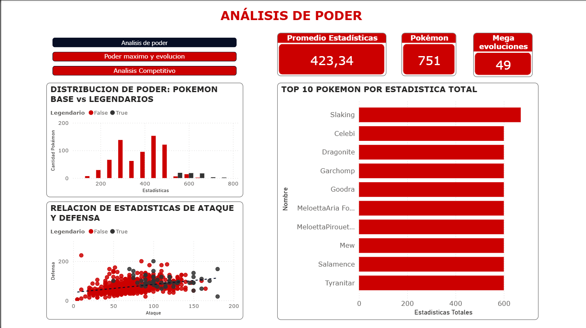
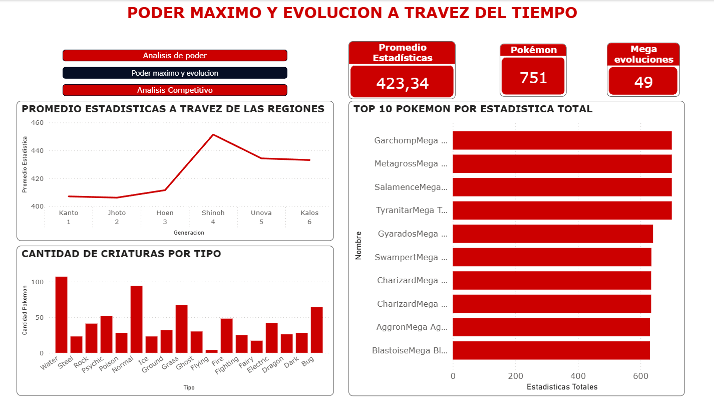
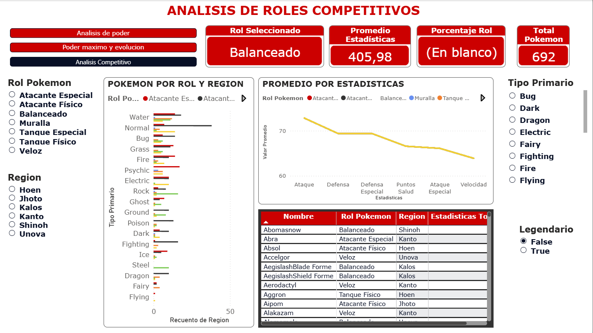

# 📊 Pokémon Data Analytics (Generación 1–6)

## 📖 Descripción

Este proyecto analiza las **estadísticas base de los Pokémon** de la primera a la sexta generación, usando **Python** (Pandas, NumPy, Matplotlib, Seaborn) para explorar, limpiar y analizar los datos, y **Power BI** para crear visualizaciones interactivas.

El enfoque principal está en las estadísticas base (HP, Ataque, Defensa, Ataque Especial, Defensa Especial y Velocidad), identificando patrones y comparaciones entre legendarios, megaevoluciones y generaciones.

El proyecto muestra un **flujo completo de análisis**, incluyendo limpieza de datos, visualizaciones en Python y Power BI, y resalta los hallazgos más importantes del dataset.


---

# 📁 Estructura del Proyecto Pokémon Data Analytics

```
/Pokemon-Data-Analytics
│
├─ /data                    # Datos originales y procesados
│   ├─ /raw                 # Datos sin modificar
│   │   └─ pokemon.csv
│   └─ /processed           # Datos limpios y listos para análisis
│       ├─ Pokedex_Base.parquet
│       ├─ Top_Pokemon.parquet
│       ├─ Megaevoluciones.parquet
│       └─ Top_Pokemon_Megas.parquet
│
├─ /notebooks               # Notebooks de Python
│   ├─ 01_exploracion.ipynb
│   ├─ 02_data_cleaning.ipynb
│   ├─ 03_data_analysis.ipynb
│   └─ 04_visualizations.ipynb
│
├─ /informes                # Archivos finales
│   ├─ Informe_Pokemon_Data_Analytics.pdf
│   └─ Pokemon_Analytics.pbix
│
├─ README.md                # Documentación del proyecto
├─ requirements.txt         # Librerías necesarias para reproducir el proyecto
└─ .gitignore               # Archivos y carpetas que Git debe ignorar
```
---

## 🛠️ Tecnologías y Herramientas

* 🐍 **Python 3.12.4
* 📚 **Librerías:** Pandas, NumPy, Seaborn, Matplotlib
* 📊 **Power BI:** Dashboard interactivo y visualizaciones
* 💾 **Parquet:** Formato de almacenamiento eficiente
* 🌐 **GitHub:** Versionamiento y documentación

---

## 🎯 Objetivos del Proyecto

**General:**
Analizar las estadísticas base de los Pokémon de la primera a la sexta generación utilizando Python y Power BI, con el fin de identificar patrones, diferencias relevantes y tendencias generales que permitan comprender el rendimiento potencial de cada especie dentro del juego.

**Específicos:**

* Realizar la exploración y limpieza del dataset, asegurando que la información esté completa, coherente y lista para su análisis.

* Analizar las estadísticas base (HP, Ataque, Defensa, Ataque Especial, Defensa Especial y Velocidad) para identificar distribuciones, valores sobresalientes y relaciones significativas.

* Comparar categorías clave como legendarios, megaevoluciones y generaciones, observando diferencias y posicionamiento relativo entre ellas.

* Construir visualizaciones estadísticas en Python que representen los datos de forma clara y faciliten la identificación de patrones y hallazgos importantes.

* Diseñar un panel interactivo en Power BI que resuma los resultados principales y permita una lectura dinámica del análisis completo.

* Documentar cada etapa del proceso, dejando claros los criterios aplicados, hallazgos obtenidos y conclusiones derivadas del estudio del dataset.

---

## 📊 **Hallazgos Clave**

El análisis del ecosistema competitivo de Pokémon revela varios patrones importantes que ayudan a comprender el comportamiento y rendimiento de estas criaturas dentro del juego:

### 🧩 **1. El equilibrio depende del rol, no de las estadísticas generales**
La clasificación por **Roles Competitivos** confirma que el juego está construido bajo un principio de *trade-off*:  
Pokémon con alta ofensiva sacrifican defensa o velocidad, mientras que los más defensivos suelen perder capacidad ofensiva.  
Esto demuestra que el balance no se basa en igualar estadísticas, sino en **especializar funciones**.

### 🔥 **2. Los Tipos condicionan la estrategia**
Aunque el análisis se centró en estadísticas base, la distribución real de los **Tipos** evidenció desequilibrios que influyen en el competitivo.  
Esto obliga a crear **estrategias específicas** para contrarrestar los tipos más comunes y adaptar las decisiones según cada enfrentamiento.

### 📈 **3. Inflación de poder a través de las generaciones**
Se observa una tendencia histórica hacia la **inflación de estadísticas**, alcanzando su punto más alto en **Sinnoh (Generación 4)**.  
En generaciones posteriores, el poder promedio se estabiliza, sugiriendo un ajuste en el diseño para mantener el balance general del juego.

### 🌀 **4. Las Megaevoluciones cambiaron el metajuego**
La implementación de las **Megaevoluciones** en la Generación 6 redefinió por completo la escala de poder competitivo:  
- Presentan estadísticas comparables a las de los **Pokémon Legendarios**  
- Incorporan nuevas dinámicas estratégicas  
- Elevan la importancia de la gestión de **Tipos y Habilidades**

### 🎯 **En resumen**
El ecosistema competitivo de Pokémon se sostiene sobre una lógica clara:  
- **La especialización supera la fuerza bruta**  
- **La estrategia pesa más que los números absolutos**  
- **Roles + Tipos + Megaevoluciones conforman el metajuego actual**
---

---
## 📊 Vista del Dashboard en Power BI






---
## 🚀 Uso del Proyecto

Sigue estos pasos para ejecutar el proyecto en cualquier máquina:

### 1. Clonar el repositorio
```bash
git clone https://github.com/tu-usuario/tu-repo.git
cd tu-repo
```
2. Crear y activar un entorno virtual (opcional, pero recomendado)
```
Windows:

python -m venv venv
venv\Scripts\activate

Bash

python3 -m venv venv
source venv/bin/activate
```
3. Instalar dependencias

Asegúrate de usar Python 3.12.4 (o una versión compatible).
```
pip install -r requirements.txt

```
El archivo requirements.txt contiene todas las librerías necesarias para que el proyecto funcione correctamente en otra máquina.
Sin este archivo, la persona tendría que instalar manualmente cada dependencia.

4. Ejecutar el análisis

Abre el archivo principal del proyecto (por ejemplo: 04_visualizations.ipynb) en Jupyter Notebook, VS Code o tu entorno preferido:
```
jupyter notebook
```

Luego ejecuta las celdas para visualizar la exploración, el análisis y las gráficas.

5. Visualizaciones en Power BI

En la carpeta correspondiente encontrarás el archivo:
```
pokemon_dashboard.pbix
```

Ábrelo directamente en Power BI Desktop para explorar las visualizaciones interactivas.

```
git clone https://github.com/TU_USUARIO/Pokemon-Data-Analytics.git
```

2. Abrir los notebooks en **Jupyter** o **VSCode** para ejecutar el análisis.
3. Abrir **Pokemon_Dashboard.pbix** en Power BI para interactuar con el dashboard.
4. Revisar **Informe_Final_Proyecto_Analisis_de_Datos_Pokemon.pdf** para entender el flujo y hallazgos.

---

## 🔍 Resultados

El proyecto permite:

* Visualizar distribuciones y comparaciones de estadísticas base.
* Analizar megaevoluciones y roles de Pokémon.
* Obtener insights para análisis competitivo.
* Tener un ejemplo completo de flujo de trabajo de análisis de datos reproducible.

---

## 📬 Contacto

Para feedback, dudas o recomendaciones:
* ✉️ hoyosrioscarlosmario@gmail.com
* 🌐 www.linkedin.com/in/carlosmario-hoyosrios

---

## ⚖️ Licencia

Este proyecto se publica bajo la licencia **MIT**, pero su propósito es **exclusivamente educativo** y no tiene fines comerciales.  
Todos los nombres, marcas, personajes y elementos relacionados con **Pokémon** pertenecen a **Nintendo, Game Freak y The Pokémon Company**.

Este repositorio *no distribuye contenido oficial*, solo análisis propios realizados con datos de libre acceso para fines de aprendizaje.  
Si alguna entidad propietaria considera que algún material vulnera derechos, será atendido y retirado inmediatamente.

